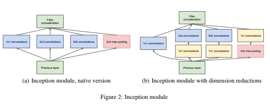
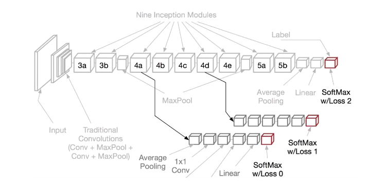
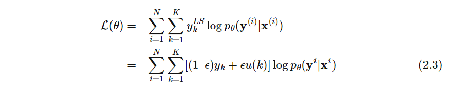

# GoogleNet
## ポイント
- ネットワーク構造をsparseではなく、**Dense(密)** で表現する。パラメータを削減し、深いネットワーク構造を実現
- 密なネットワーク構造を実現するために、**Inception module** によって、相関のあるニューロンをまとめる
- 最終層の特徴量マップを各チャンネル毎に平均をとっている **(Global Avarage Pooling)** 。全結合層のパラメータ削減と過学習抑制を行っている。
## Inception module
</img>
- Conv1×1でchannel方向に畳み込み、情報を圧縮。パラメータを削減する。
- Conv3×3, 5×5によって、様々なスケールで特徴量を取得できる。つまり、同じ位置の画像空間上の特徴量マップを畳み込み、相関のあるニューロンをまとめることができる。
- Pool層でinput生データをConcatenateする。**畳み込みによる情報消失を防ぐ**
## Global Average Pooling
- ネットワークの最後の全結合層の代わりに取り入れられた手法
- 各チャンネルの値の平均を算出することでパラメータ数を削減し、過学習を抑制
## Auxiliary Loss
</img>
- 勾配消失問題を防ぐために、ネットワークの途中から分岐させたサブネットワークにおいてもクラス分類を行う手法
- ネットワークの中間層に直接誤差が伝搬することで、中間層の勾配消失の防止・学習の効率化・ネットワークの正則化が実現
- サブネットワークなど複数の学習器を使うため、アンサンブル学習と同様の効果が得られると言われている
## トレーニング方法
- 確率的勾配降下法
- momentum = 0.9 
- 固定学習率スケジュール (8 エポックごとに学習率を 4% ずつ減少) を使用
- データオーギュメンテーション:　画像領域の 8% から 100% で、アスペクト比が 3/4 から 4/3 で、ランダムにパッチをサンプリング
(データオーギュメンテーションは右記論文を参考にしたようだ：https://arxiv.org/ftp/arxiv/papers/1312/1312.5402.pdf)
- Inception V3ではラベル平滑化によって、過学習を防いでいる
## テスト推論
- 水増し手法を変えた学習データで、7つのGoogleNetをトレーニング。それのアンサンブルによって、最高エラー率をたたき出した。
- 具体的には、画像を 4 つのスケールでそれぞれ 256、288、320、352 にリサイズし、画像の左、中央、右でパッチを取得　(縦長の画像の場合は、 上、中央、下）。
- パッチから、4 つの角と中央の 224×224 トリミング、さらに、それらのHorizontal Flipを取得。 これにより、画像ごとに 4×3×6×2 = 144 のパッチを取得。 
- 最後にこれら全てのソフトマックス予測値を平均し、アンサンブル。最終予測確率を導出。
## 参考
1. https://arxiv.org/pdf/1409.4842.pdf
2. https://www.youtube.com/watch?v=p-SflGf3m2Y
3. https://ai-kenkyujo.com/artificial-intelligence/ai-architecture-02/
4. https://iwiwi.hatenadiary.jp/entry/2016/12/31/162059　(データオーギュメンテーションまとめ)
5. https://cvml-expertguide.net/terms/dl/regularization/label-smoothing/#1_%E3%83%A9%E3%83%99%E3%83%AB%E5%B9%B3%E6%BB%91%E5%8C%96_Label_Smoothing_%E3%81%A8%E3%81%AF_%E6%A6%82%E8%A6%81（ラベル平滑化まとめサイト）
## ※ラベル平滑化
- クラス分類損失に対する正則化手法の１つである
- ラベル平滑化では，one-hot符号化されたハードなラベルの代わりに，ノイズを加えたソフトなラベルで学習する
- これにより学習のターゲットであるハードラベルへの過学習を防ぐことができる<br>
```math
y^{LS}_K = (1-ε)y_K＋ε\frac{1}{K}
```
```math
\sum_{K=1}^{K} y^{Loss}_{K} = 1 
```
- $ε：(0,1)$ でハイパーパラメータ , $K$：正解ラベル数, $y^{LS}_K$：ラベル平滑化後の正解ラベル
</img>
- 近年のCNN学習では，**データ拡張とラベル平滑化は併用することが多い**
- **ノイジーラベル(Noisy Labels)への対抗手段の１つとしても，ラベル平滑化がよく用いられる**
- まとめると,ラベル平滑化は**クラス識別CNNのsoftmax出力の分布をなめらかにさせる正則化項である**。RNN，RNNLM, seq2seq with attention, Transformerなど，「クラス識別と系列ラベリング問題」の教師ありDNNの学習において，**正則化目的で広く用いられている**
